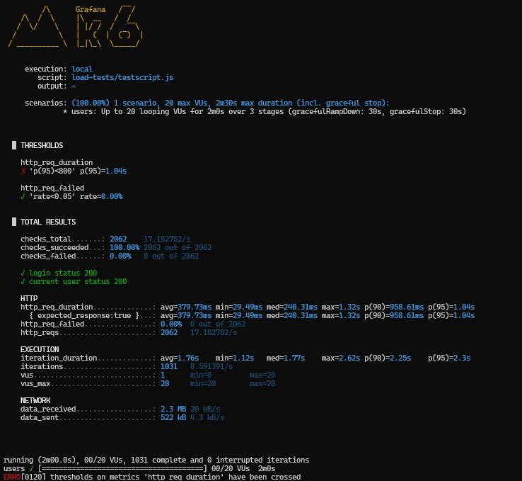
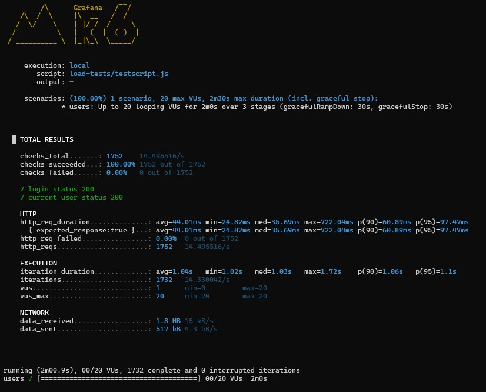

# Johndere Expense Portal

React SPA, Express API, optional Docker/nginx. Load tests live in `load-tests/`.

## k6 (`load-tests/testscript.js`) — two scenarios

Side-by-side terminal captures from the **commented** vs **active** script blocks in the same file.

<table>
  <tr valign="top">
    <td width="50%">
      <strong>Commented — login every iteration</strong><br/>
      
      <ul>
        <li>Each iteration: <code>POST /api/v1/auth/login</code> then <code>GET /api/v1/auth/me</code>.</li>
        <li>Stresses auth (bcrypt, JWT, DB) every loop.</li>
        <li>Checks can stay green while an <code>http_req_duration</code> p(95) SLO (e.g. 800&nbsp;ms) fails.</li>
      </ul>
    </td>
    <td width="50%">
      <strong>Active — login once per VU</strong><br/>
      
      <ul>
        <li>Per-VU <code>token</code> from <code>Set-Cookie</code>; later calls use <code>Cookie: token=…</code>.</li>
        <li>Closer to a real browser session (sign in once).</li>
        <li>Fewer logins → lower tail latency; thresholds pass.</li>
      </ul>
    </td>
  </tr>
</table>

Server: `login` sets httpOnly `token` — `server/controllers/auth.js`.

```powershell
k6 run -e BASE_URL=http://localhost -e TEST_EMAIL=... -e TEST_PASSWORD=... load-tests/testscript.js
```

Other scripts: `testscript-expense-create.js`, `testscript-expense-approve.js`.
