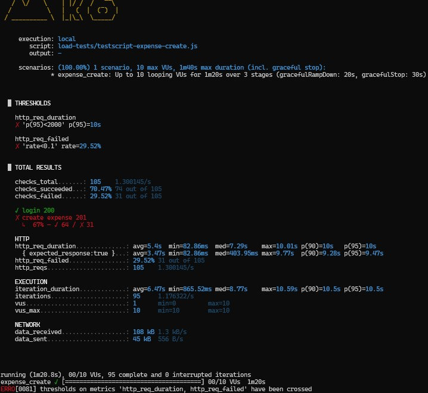
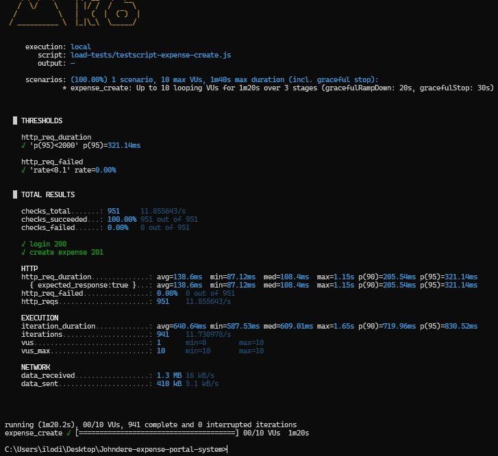
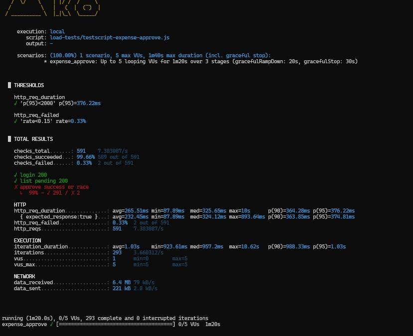
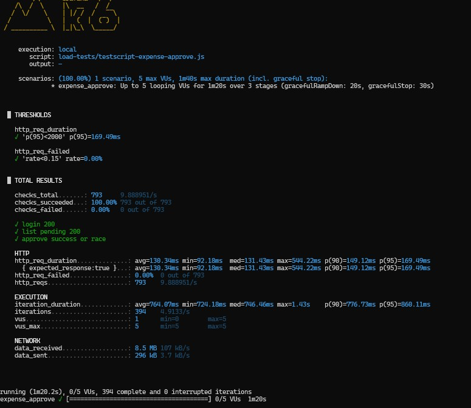

# Johndere Expense Portal

React SPA, Express API, optional Docker/nginx. Load tests live in `load-tests/`.

## (`load-tests/testscript-expense-auth.js`) — two scenarios

Side-by-side terminal captures from the **commented** vs **active** script blocks in the same file.

<table>
  <tr valign="top">
    <td width="50%">
      <strong>Commented — login every iteration</strong><br/>
      
      <ul>
        <li>Each iteration: <code>POST /api/v1/auth/login</code> then <code>GET /api/v1/auth/me</code>.</li>
        <li>Stresses auth (bcrypt, JWT, DB) every loop.</li>
        <li>Checks can stay green while an <code>http_req_duration</code> p(95) SLO (e.g. 800&nbsp;ms) fails.</li>
      </ul>
    </td>
    <td width="50%">
      <strong>Active — login once per VU</strong><br/>
      
      <ul>
        <li>Per-VU <code>token</code> from <code>Set-Cookie</code>; later calls use <code>Cookie: token=…</code>.</li>
        <li>Closer to a real browser session (sign in once).</li>
        <li>Fewer logins → lower tail latency; thresholds pass.</li>
      </ul>
    </td>
  </tr>
</table>

Server: `login` sets httpOnly `token` — `server/controllers/auth.js`.

```powershell
k6 run -e BASE_URL=http://localhost -e TEST_EMAIL=... -e TEST_PASSWORD=... load-tests/testscript-expense-auth.js
```

## (`load-tests/testscript-expense-create.js`) — two scenarios

<table>
  <tr valign="top">
    <td width="50%">
      <strong>Commented — blocking email + sequential DB reads</strong><br/>
      
      <ul>
        <li>Each request: <code>POST /api/v1/expenses</code> blocks until both <code>sendEmail()</code> calls resolve.</li>
        <li>Sequential DB reads stall the request chain further.</li>
        <li>Result: ~10s latency spikes, 29% failure rate, thresholds fail.</li>
        <li>No async offloading — every operation blocks inside the request lifecycle until fully resolved.</li>
      </ul>

```js
// slow — blocks response until emails finish
await sendEmail(employeePayload);
await sendEmail(managerPayload);
res.status(201).json({ message: "Expense submitted", expense });

// sequential DB reads
const employee = await User.findById(req.user.userId);
const manager = await User.findOne({ role: "manager" });

//  nothing escapes the request — user waits for all of it
// slow — blocks response until emails finish
const expense  = await Expense.create(data);
const employee = await User.findById(req.user.userId);
const manager  = await User.findOne({ role: "manager" });
await sendEmail(employeePayload);   // still waiting...
await sendEmail(managerPayload);    // still waiting...
res.status(201).json({ ... });      // user finally gets a response
```

</td>
    <td width="50%">
      <strong>Active — fire-and-forget email + parallel DB reads</strong><br/>
      
      <ul>
        <li>Response sent immediately after DB write; emails offloaded via <code>setImmediate</code>.</li>
        <li>DB reads parallelised with <code>Promise.all</code>.</li>
        <li>Result: latency drops sharply, 0% failures, all thresholds pass.</li>
        <li>Emails wrapped in <code>setImmediate</code> with full async error handling — completely outside the request lifecycle.</li>
      </ul>

```js
//  respond first, email in background
//  fire-and-forget with proper async/error handling
res.status(201).json({ message: "Expense submitted", expense });
setImmediate(() => {
  sendEmail(employeePayload);
  sendEmail(managerPayload);
});

//  parallel DB reads
const [employee, manager] = await Promise.all([
  User.findById(req.user.userId).select("name email"),
  User.findOne({ role: "manager" }).select("name email"),
]);
```

</td>
  </tr>
</table>

Server: `createExpense` lives in `server/controllers/expense.js`.

```powershell
k6 run -e BASE_URL=http://localhost -e TEST_EMAIL=... -e TEST_PASSWORD=... load-tests/testscript-expense-create.js
```

## (`load-tests/testscript-expense-approve.js`) — two scenarios

<table>
  <tr valign="top">
    <td width="50%">
      <strong>Commented — sequential DB reads + race condition</strong><br/>
      
      <ul>
        <li>Two separate DB operations create a race window — another request can modify the expense between reads.</li>
        <li>Sequential DB reads stall the request chain.</li>
        <li>Blocking email I/O inside the request lifecycle adds tail latency.</li>
        <li>Result: 0.33% failure rate, 10s max latency spike, <code>approve success or race</code> check fails.</li>
      </ul>

```js
//  two round trips — race window between them
const expense = await Expense.findById(id);
if (expense.status !== "pending") {
  throw new BadRequestError(...);
}
const updatedExpense = await Expense.findByIdAndUpdate(
  id,
  { status },
  { new: true }
);
```

</td>
    <td width="50%">
      <strong>Active — atomic DB operation, no race</strong><br/>
      
      <ul>
        <li>Single atomic <code>findOneAndUpdate</code> with condition — no race window possible.</li>
        <li>Eliminates the ~0.33% concurrent approval failures seen under load.</li>
        <li>Removes long tail latency spikes; p(95) drops from 376ms to 169ms.</li>
        <li>Result: 0.00% failures, 100% checks passed, all thresholds pass.</li>
      </ul>

```js
// atomic — condition + update in one DB round trip
const updatedExpense = await Expense.findOneAndUpdate(
  { _id: id, status: "pending" }, // atomic condition
  { $set: { status } },
  { new: true },
);
if (!updatedExpense) {
  throw new BadRequestError("Expense already processed or not found");
}
```

</td>
  </tr>
</table>

Server: `approveExpense` lives in `server/controllers/expense.js`.

```powershell
k6 run -e BASE_URL=http://localhost -e TEST_EMAIL=... -e TEST_PASSWORD=... load-tests/testscript-expense-approve.js
```
